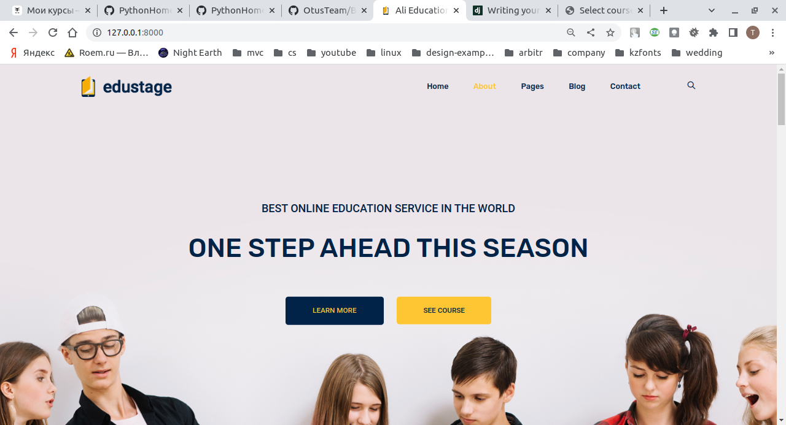
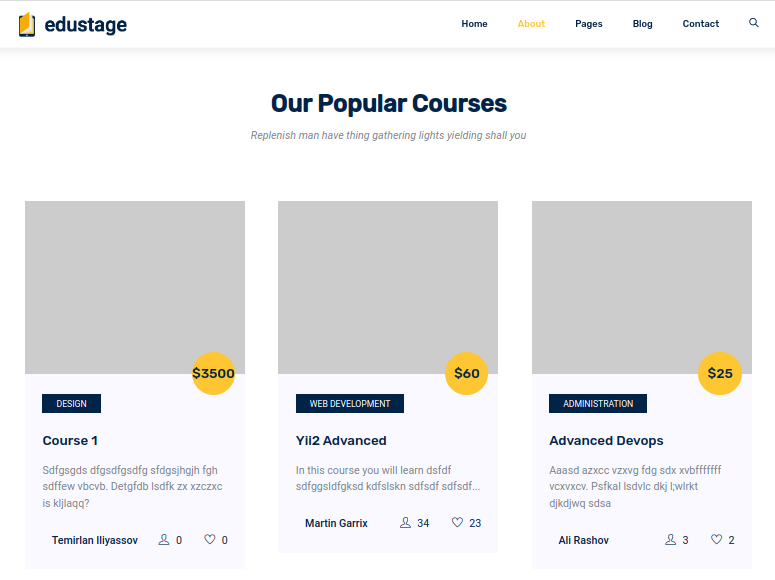
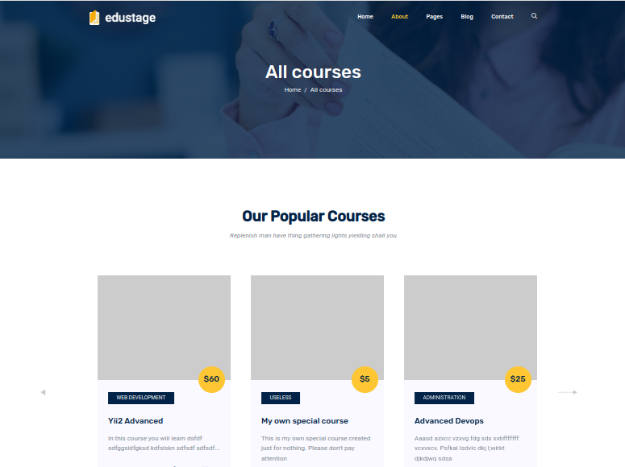
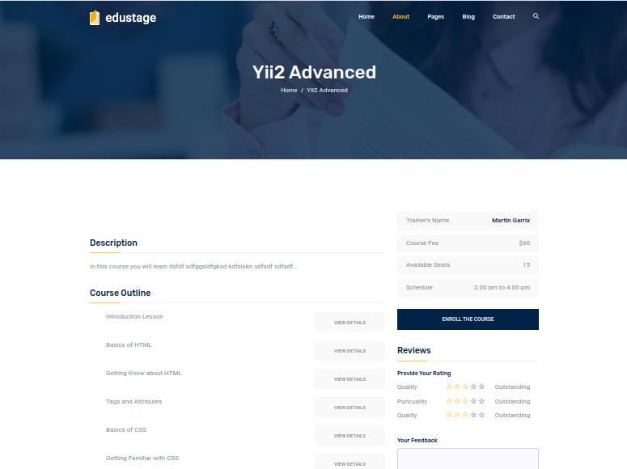

### Домашнее задание "Django проект"
#### Задача:
- выберите направление для вашего Django проекта. 
  Данный проект может стать выпускной работой. 
  Это может быть интернет-магазин, блог, новостной ресурс и т.д. 
  Также можно просто перенести логику уже написанного Flask приложения
- создайте проект, приложение
- создайте модели
#### Критерии оценки:
- создан проект
- создано и установлено приложение
- созданы модели
- созданы миграции
#### Результаты работы:

Домашнее задание представляет из себя портал онлайн обучения.

Созданные модели:
- Курсы
- Категории курсов
- Преподаватели

##### Главная страница

##### Список курсов на главной

##### Страница списка курсов

##### Страница конкретного курса
